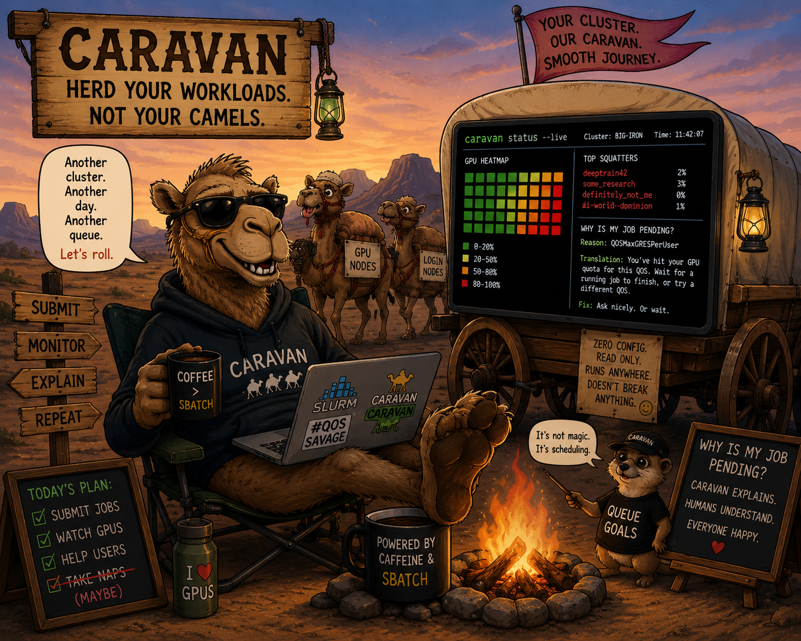
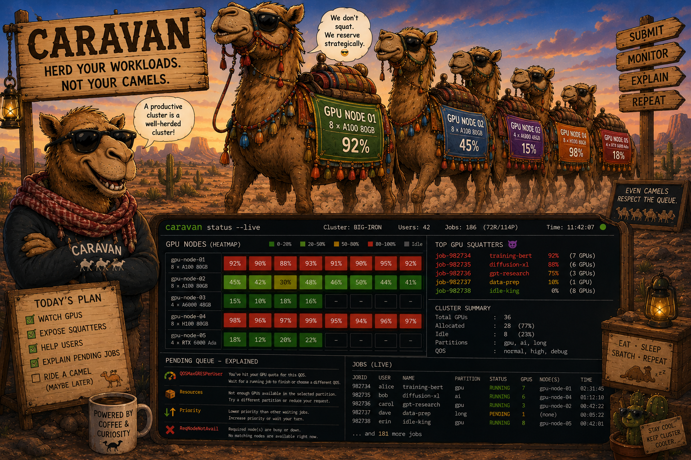

# Caravan 🚚

> **A CLI for GPU Slurm stand up a cluster and run workloads on it.**



Slurm is powerful but a chore to operate and submit to. Caravan is a single binary
that carries a GPU Slurm cluster *inside it* and makes it a one-liner to bring up —
then (next) submit jobs, track experiments, and rerun workloads, with
[squint](https://github.com/hiteshsahu/squint) watching the queue and gpulens
watching the GPUs.




> Caravan **uses** Slurm — it doesn't replace it. Slurm stays the scheduler;

> Caravan is the control plane and developer experience around it.


## Install

```bash
go install github.com/hiteshsahu/caravan@latest
```

## Stand up a cluster

```bash

# builds the image, starts controller + 2 GPU nodes
caravan cluster up    
   
# container state, then `sinfo`
caravan cluster status   

# stop      (add -v to wipe state) 
caravan cluster down      

```

`caravan cluster up` writes an embedded Slurm scaffold to `~/.caravan/cluster`
and runs `docker compose` against it. 

Requires **Docker + Compose v2**. The two
compute nodes advertise `gpu:4` each as **fake, count-only GPUs** — real GPU
scheduling, no hardware needed (no `nvidia-smi` telemetry, though).

Healthy looks like:

```bash

  PARTITION AVAIL  TIMELIMIT  NODES  STATE NODELIST
  gpu*         up   infinite      2   idle c1,c2
  
```

## 📁 Folder Structure

```
  caravan/
  ├── main.go
  ├── internal/
  │   ├── cli/                 # cobra commands
  │   │   ├── root.go
  │   │   └── cluster.go       # caravan cluster up|down|status
  │   └── cluster/
  │       ├── cluster.go       # extract scaffold + docker compose
  │       └── assets/          # the GPU Slurm cluster, embedded in the binary
  │           ├── Dockerfile · entrypoint.sh
  │           ├── docker-compose.yml
  │           └── slurm.conf · gres.conf
```

The cluster definition is embedded with `//go:embed`, so the binary is
self-contained — there's no separate cluster repo to clone. `caravan cluster up`
extracts it and runs it.

## 🗺️ Roadmap

Caravan grows from "runs a cluster" to "runs your work on it."

- **cluster** *(here)* — `up` / `down` / `status`. Docker today; cloud / bare-metal
  backends later, behind the same interface.
- **submit** — `caravan submit job.yaml` → generates an sbatch script → submits to
  the cluster → records the job. `status` / `logs` to follow it.
- **rerun** — re-launch a past job by id, reproducibly.
- **exp** — group runs into experiments and compare them.

Each new capability sits behind a `Backend` interface (Slurm today), so swapping
the execution target later doesn't touch the CLI above it.

---

## License
*© 2026 [Hitesh Kumar Sahu](https://hiteshsahu.com) · Licensed under [Apache 2.0](https://www.apache.org/licenses/LICENSE-2.0)*

